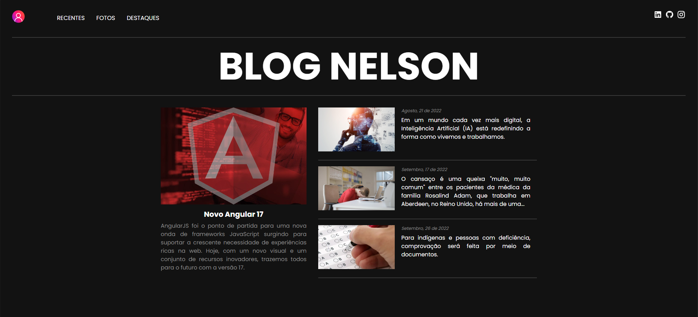

<h1 align="center">Angular Blog - Nelson</h1>

	Blog feito com Angular e TypeScript no <a href="https://www.dio.me/bootcamp/coding-future-banco-pan-desenvolvimento-frontend-com-angular" target="_blank">BOOTCAMP</a> promovido pela 
	<a href="https://www.dio.me/" target="_blank">DIO</a> e pelo <a href="https://www.bancopan.com.br/" target="_blank">BANCO PAN</a> e ministrado pelo 
	<a href="https://github.com/felipeAguiarCode" target="_blank">Felipe Aguiar</a> 
 

 

  

## 🚀 Tecnologias

Esse projeto foi desenvolvido com as seguintes tecnologias:

- HTML e CSS
- TypeScript
- Git e Github
- Angular
- Saas (scss)

## 🗺️ Roadmap

O projeto é a plicação prática de todo o conteúdo ministrado durante o bootcamp, onde fiz algumas customizações pessoais tanto no visual quanto na dinâmica do blog.

- Escolha da referencia para o start do front-end
- Análise estrutural para uso dos componentes
- Criação e estilização dos componentes do blog com Saas
- Adicionando responsividade ao blog ( *EM IMPLEMENTAÇÃO* )
- Adicionado dinâmica ao blog

Feito com ♥ by Nelson Soares